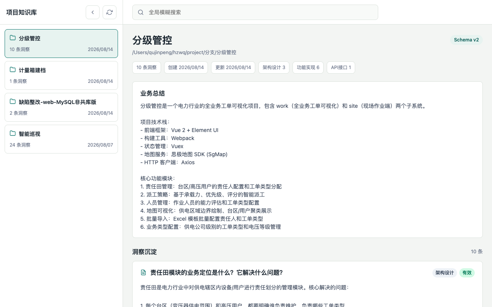
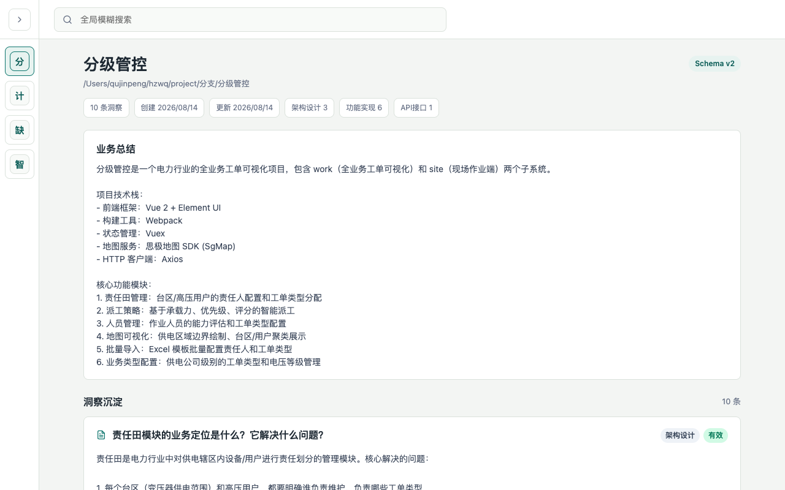
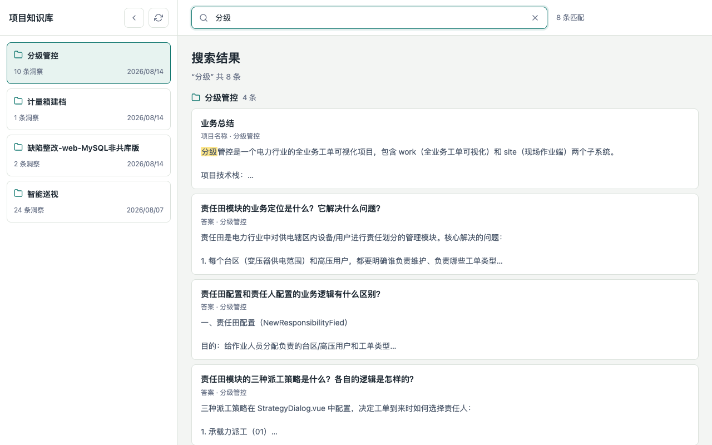

# Project Analysis MCP

一个基于 [Model Context Protocol (MCP)](https://modelcontextprotocol.io) 的**项目知识管理服务器**，用于在 AI 编程助手中持久化存储和检索项目分析结果。

> 总控开发上下文见 [AGENT.md](./AGENT.md)，后续开发以该文件为总纲。

## 🎯 项目简介

在 AI 辅助编程过程中，我们经常需要让 AI 理解项目的业务逻辑和架构设计。然而每次对话都是"从零开始"，AI 无法记住之前分析过的内容。

**Project Analysis MCP** 解决这个问题——它将 AI 对项目的分析结果（业务总结、架构设计、功能实现、数据流等）持久化存储到本地 JSON 文件中。下次分析同一项目时，AI 可以直接检索已有知识，**避免重复分析，显著提升效率**。

## ✨ 核心特性

- **项目知识管理** — 创建、更新、查看已分析项目的知识库
- **洞察记录与检索** — 记录 AI 分析产生的业务洞察，支持按关键词、分类、标签检索
- **文件快照与溯源** — 自动为关联文件生成快照（mtime/size/hash），追踪知识依赖的代码
- **知识新鲜度检查** — 自动检测关联代码是否变化，标记过期知识，避免使用失效结论
- **影响范围分析** — 修改文件前分析影响范围，评估风险等级，关联受影响的知识和模块
- **知识版本管理** — 每条洞察支持版本号，更新时自动递增，便于追踪知识演进
- **自动去重** — 相似问题自动合并更新，避免知识冗余
- **持久化存储** — 知识以 JSON 文件形式保存在 `~/.project-analysis-mcp/knowledge/` 目录
- **旧数据兼容** — Schema 版本自动迁移，升级不影响已有知识
- **Project Analyzer** — 自动静态分析 Web 项目，生成模块、页面、API、实体、权限、业务能力、状态和工作流
- **Workflow Generator** — 自动组合 Tool，生成可编排的业务流程
- **Agent Runtime** — 统一 LLM Provider，驱动意图理解、Tool/Workflow 选择和参数化执行
- **AI 操作层 Web UI** — 通过自然语言对话直接操作当前项目，展示 Tool 过程、参数、确认和结果
- **代码搜索** — 在指定项目目录中按关键词搜索代码文件

## 🛠️ 提供的工具（Tools）

| 工具名 | 说明 |
|---|---|
| `analyze_project` | 分析项目并记录业务总结。首次调用创建知识库，后续调用更新业务总结 |
| `analyze_project_static` | 自动静态分析 Web 项目，生成或增量更新 AI 可操作 Project Knowledge |
| `get_project_analysis` | 获取指定项目已生成的 Project Knowledge 结构化 JSON |
| `generate_project_tools` | 根据业务能力生成 AI Tool 并写入 Tool Registry |
| `list_registered_tools` | 列出项目已注册的 AI Tool |
| `get_registered_tool` | 获取单个已注册 Tool 的完整定义 |
| `get_tool_registry` | 获取项目完整 Tool Registry JSON |
| `generate_project_workflows` | 根据 Tool Registry 和 Project Knowledge 生成业务 Workflow |
| `list_registered_workflows` | 列出项目已注册的 Workflow |
| `get_registered_workflow` | 获取单个 Workflow 的完整结构化定义 |
| `get_workflow_registry` | 获取项目完整 Workflow Registry JSON |
| `configure_llm_provider` | 配置统一 LLM Provider，支持 OpenAI 和 OpenAI Compatible API |
| `get_llm_config` | 获取当前 LLM Provider 配置（API Key 脱敏） |
| `agent_chat` | 向 Agent Runtime 发送用户消息并执行 Tool/Workflow |
| `agent_list_sessions` | 列出 Agent 会话 |
| `agent_get_session` | 获取 Agent 会话上下文 |
| `agent_list_execution_logs` | 获取 Agent 执行日志 |
| `record_insight` | 记录对项目代码的业务分析洞察（架构、功能、API、数据流等），支持分类、标签、符号、模块、API 关联，自动生成文件快照 |
| `search_insights` | 搜索已有的洞察记录以复用历史分析，可选启用新鲜度检查（checkFreshness） |
| `get_project_overview` | 获取项目的完整概览，包括业务总结、洞察统计（按分类/状态） |
| `list_projects` | 列出所有已分析过的项目 |
| `delete_insight` | 删除指定的洞察记录 |
| `check_knowledge_freshness` | 检查指定知识关联的代码是否变化，支持单条 Insight 或整个项目 |
| `refresh_project_knowledge` | 扫描项目所有知识，统计有效/过期/无快照的数量 |
| `analyze_impact` | 分析修改某文件的影响范围，包含直接/间接引用、关联知识（含新鲜度）、风险评分 |
| `get_full_context` | 【整合工具】一次性获取某个问题的完整上下文：搜索知识 + 检查新鲜度 + 影响分析 |
| `search_code` | 在项目中按关键词搜索代码文件（实验性功能） |

## 🤖 Project Analyzer

`analyze_project_static` 接收一个 Web 项目目录，自动建立 AI 可操作知识模型：

```json
{
  "project": {},
  "modules": [],
  "pages": [],
  "apis": [],
  "entities": [],
  "permissions": [],
  "capabilities": [],
  "workflows": [],
  "states": []
}
```

它不会执行项目代码，也不会直接调用项目 API。分析结果保存在原 Project Knowledge 文件中，重复分析时按稳定 ID 增量合并。

## 🧰 Tool Generator

`generate_project_tools` 根据 Project Knowledge 中的业务能力生成 AI Tool，例如 `POST /plan/create` 会生成业务 Tool `create_plan`，而不是 `post_plan_create`。

每个 Tool 包含：

```json
{
  "name": "create_plan",
  "description": "",
  "confidence": "high",
  "module": "Plan",
  "businessPurpose": "",
  "sourceFiles": [],
  "sourceApis": [],
  "sourcePages": [],
  "sourceMethods": [],
  "inputSchema": {},
  "outputSchema": {},
  "apiMapping": {},
  "permission": "plan:create",
  "riskLevel": "low",
  "requiresConfirmation": false,
  "preconditions": [],
  "postconditions": [],
  "relatedTools": [],
  "relatedPages": []
}
```

Tool 只描述参数映射、权限、风险、确认策略和原系统 API 调用方式；真正执行时仍调用原有业务 API，不复制业务规则，不绕过原系统权限。每个 Tool 都保留 `sourceFiles`、`sourceApis`、`sourcePages`、`sourceMethods` 和 `confidence`，方便人工追溯和判断可信度。

## 🔀 Workflow Generator

`generate_project_workflows` 根据 Tool Registry 和 Project Knowledge 自动组合原子 Tool。例如用户意图“创建一个明天的巡检计划并提交审批”，会生成：

```text
create_plan → submit_plan
```

对应 Workflow：

```json
{
  "name": "create_and_submit_plan",
  "confidence": "high",
  "sourceTools": ["create_plan", "submit_plan"],
  "sourcePages": [],
  "steps": [
    {
      "tool": "create_plan",
      "output": "plan"
    },
    {
      "tool": "submit_plan",
      "input": {
        "planId": "$plan.id"
      }
    }
  ]
}
```

Workflow 使用结构化定义，不写死执行代码。支持条件分支、参数传递、前置条件、失败处理、用户确认、暂停等待输入和继续执行，并保留 `confidence`、`sourceTools`、`sourcePages` 来源信息。

## 🤖 Agent Runtime

Agent Runtime 使用统一 `LLMProvider` 接入 OpenAI 或任意 OpenAI Compatible API：

```json
{
  "provider": "openai-compatible",
  "baseURL": "https://api.example.com/v1",
  "apiKey": "your-key",
  "model": "your-model"
}
```

执行流程：

```text
User → Agent → LLM → Tool/Workflow Selection
    → Parameter Validation → Permission → Confirmation
    → Tool Execution → Result → LLM → User
```

Agent Runtime 支持：
- 多轮对话和会话上下文
- LLM Tool Call
- 多 Tool 连续调用
- Workflow 编排
- 参数缺失询问
- 用户确认
- 权限检查
- 错误重试
- 执行日志

## 🖥️ AI 操作层 Web UI

访问 `http://127.0.0.1:9527/ai.html` 进入 AI 操作层。

界面能力：
- 自然语言对话操作当前项目
- Tool/Workflow 执行过程展示
- Tool 参数展示
- 用户确认/取消
- 执行结果表格和错误提示
- 会话历史与执行历史

AI UI 不复制原系统业务页面；复杂页面仍通过后续 `open_page` / `open_detail` / `navigate` 类能力跳转到原系统页面。

## 📦 安装

### 前置条件

- [Node.js](https://nodejs.org/) >= 18
- npm

### 安装步骤

```bash
# 1. 克隆或下载项目
cd project-analysis-mcp

# 2. 安装依赖
npm install
```

## 🚀 使用方式

### 在 AI 客户端中配置

本 MCP 服务器使用 **stdio** 传输协议。需要在你的 AI 客户端（如 Claude Desktop、Cursor、Codex 等）的 MCP 配置文件中添加以下配置：

```json
{
  "mcpServers": {
    "project-analysis": {
      "command": "npx",
      "args": [
        "tsx",
        "/path/to/project-analysis-mcp/src/index.ts"
      ]
    }
  }
}
```

> 请将 `/path/to/project-analysis-mcp` 替换为你的实际项目路径。

### 开发调试

```bash
# 启动开发服务器
npm run dev

# 启动 Web 查看界面
npm run web

# 运行测试
npm test
```

### Web 查看界面

Web 界面直接读取 `~/.project-analysis-mcp/knowledge/` 中的知识 JSON，不依赖 MCP stdio 连接。默认监听 `0.0.0.0:9527`，本机访问 `http://127.0.0.1:9527`。

主要功能：
- 左侧展示已分析的项目列表，右侧展示业务总结和洞察记录
- 顶部支持跨项目模糊搜索，命中结果按项目分组展示
- 侧栏收起后显示项目名称首字，便于快速区分不同应用
- 窄屏下自动切换为顶部横向项目列表布局

```bash
# 自定义端口
PORT=8080 npm run web

# 仅本机访问
HOST=127.0.0.1 npm run web
```

#### 界面截图







## 📖 使用流程

详细的使用示例和配置方法请参考：
- [examples/usage-examples.md](./examples/usage-examples.md) — 基本用法和配置示例
- [examples/real-usage-records.md](./examples/real-usage-records.md) — 真实项目使用记录（分级管控、智能巡视）

基本流程：
1. 让 AI 分析项目 → 自动创建知识库
2. 提出具体问题 → AI 记录洞察并生成文件快照
3. 再次提问 → AI 检索已有洞察，避免重复分析
4. 查看概览 → 了解项目积累的分析成果

## 🔄 V2 集成工作流

V2 版本（v5.0.0）实现了完整的"代码 → 依赖关系 → 知识 → 新鲜度 → 影响分析"闭环。

### 场景一：复用历史知识

用户问："这个项目的单位权限逻辑是什么？"

```
AI 决策流程：
├── search_insights("单位权限")
├── 找到历史知识
├── checkFreshness: true（启用新鲜度检查）
├── 🟢 fresh → 直接复用历史结论
└── 🔴 stale → 告诉用户"历史知识存在，但关联代码已变化，需要重新验证"
     └── 重新分析代码 → record_insight 更新知识
```

### 场景二：分析变更影响

用户问："修改 unit.js 会影响什么？"

```
AI 决策流程：
├── analyze_impact("src/store/unit.js")
├── 得到：直接引用 12 个文件、间接影响 27 个文件
├── 关联知识 6 条
├── 风险评分 HIGH (62/100)
└── 建议：修改前请重点关注这些模块和页面
```

### 场景三：完整上下文查询

用户问："这个项目的单位逻辑是什么？最近有没有变化？修改会影响哪些页面？"

```
AI 决策流程：
├── get_full_context({
│     projectName: "分级管控",
│     question: "单位逻辑",
│     targetFile: "src/store/unit.js"
│   })
├── Part 1: 搜索知识 + 检查每条知识的新鲜度
├── Part 2: 影响范围分析（含关联知识的新鲜度）
└── Part 3: 建议后续操作
```

## 🤖 AI Agent 工作流

MCP **不会**自己调用大模型。MCP 负责提供数据，AI Agent 负责决策。

### 职责边界

| 角色 | 职责 |
|------|------|
| **MCP** | 查代码、查依赖、查知识、查新鲜度、保存知识 |
| **AI Agent** | 理解问题、判断是否需要重新分析、综合结果、生成新知识 |

### AI 决策树

```
用户提问
  │
  ├── search_insights（搜索历史知识）
  │     │
  │     ├── 找到知识 + checkFreshness
  │     │     │
  │     │     ├── 🟢 fresh → 直接复用，回答问题
  │     │     │
  │     │     └── 🔴 stale → 警告用户
  │     │           │
  │     │           ├── analyze_project / search_code（重新分析）
  │     │           │
  │     │           └── record_insight（更新知识，重置 fresh 状态）
  │     │
  │     └── ⚪ unknown（旧知识无快照）→ 可选更新以补充快照
  │
  └── 未找到知识
        │
        ├── search_code / analyze_project（分析代码）
        │
        └── record_insight（记录新知识，附带 relatedFiles）
```

### 修改代码时的决策树

```
用户问"修改 X 会影响什么？"
  │
  ├── analyze_impact(X)
  │     │
  │     ├── 直接引用文件列表
  │     ├── 间接影响文件列表
  │     ├── 关联模块 / API
  │     ├── 关联历史知识（含新鲜度）
  │     └── 风险评分（可解释）
  │
  └── AI 综合判断
        │
        ├── 低风险 → 可以安全修改
        ├── 中风险 → 建议重点测试相关模块
        └── 高风险 → 建议分步修改，逐步验证
```

## 🔍 知识新鲜度（P0-2）

当代码发生变化时，系统可以自动检测历史知识是否仍然可信。

### 检查策略

采用两层检查，避免不必要的 hash 计算：

```
第一层（快速）：比较 mtime + size
  └── 没有变化 → ✅ fresh
  └── 有变化 → 进入第二层

第二层（精确）：计算 SHA-256 hash
  └── hash 相同 → ✅ fresh（mtime 变化但内容没变，如 touch）
  └── hash 不同 → 🔴 stale（代码确实变了）
```

### 新鲜度状态

| 状态 | 含义 | 说明 |
|------|------|------|
| 🟢 fresh | 代码未变化 | 知识仍然可信 |
| 🔴 stale | 代码已变化 | 知识需要重新验证 |
| ⚪ unknown | 无快照 | 旧知识没有快照，无法判断 |

### 使用方式

**检查单条知识：**
```
帮我检查一下"单位权限逻辑"这条知识的代码有没有变
```
→ AI 调用 `check_knowledge_freshness`，返回详细的文件变化报告

**扫描整个项目：**
```
帮我看看这个项目的所有知识，有哪些需要更新
```
→ AI 调用 `refresh_project_knowledge`，输出完整的统计报告

**搜索时附带新鲜度检查：**
```
搜索认证相关的知识，顺便检查一下代码有没有变
```
→ AI 调用 `search_insights` 并设置 `checkFreshness: true`

### 重要说明

- **代码变化 ≠ 知识错误**：stale 只表示关联代码有变化，不代表知识一定失效
- **不自动重新分析**：系统只标记状态，由用户决定是否重新分析
- **不扫描整个项目**：只检查每条 Insight 实际关联的文件
- **不依赖 Git**：基于文件本身的 mtime/size/hash 判断
- **旧知识兼容**：没有快照的旧知识标记为 unknown，不会被误判为过期

## 📸 文件快照

当 `record_insight` 指定了 `relatedFiles` 时，系统会自动为这些文件生成快照：

- **path** — 归一化后的绝对路径
- **size** — 文件大小（字节）
- **mtime** — 最后修改时间（ISO 字符串）
- **hash** — SHA-256 哈希值（仅对 < 1MB 的非二进制文件生成）

快照特性：
- 只针对 `relatedFiles` 中的文件生成，不会扫描整个项目
- 相对路径基于 `projectPath` 自动解析
- 重复路径自动去重
- 不存在的文件静默跳过
- 二进制文件（图片、字体、压缩包等）仅记录 mtime + size，不生成 hash

## 💥 影响范围分析（P0-3）

在修改代码前，可以分析该文件的影响范围，评估变更风险。

### 分析内容

| 维度 | 说明 |
|------|------|
| 直接引用 | 哪些文件直接 import/require 了目标文件 |
| 间接影响 | 通过依赖链间接影响的文件 |
| 相关模块 | 从知识库中关联的业务模块 |
| 相关 API | 从知识库中关联的 API 端点 |
| 相关知识 | 依赖该文件的 Insight 记录（含新鲜度状态） |
| 风险评分 | 可解释的 0-100 分风险评分 |

### 风险评分规则

采用可解释的规则评分，每个因素有明确的权重：

| 因素 | 权重 | 说明 |
|------|------|------|
| 直接引用 | +3/个 | 每个直接引用文件 |
| 间接影响 | +1/个 | 每个间接影响文件 |
| 相关知识 | +5/条 | 每条关联的 Insight |
| 过期知识 | +8/条 | 每条 stale 状态的 Insight |
| 相关 API | +10/个 | 每个关联的 API 端点 |
| 相关模块 | +2/个 | 每个关联的业务模块 |

| 分数 | 风险等级 |
|------|---------|
| 0-19 | 🟢 low |
| 20-49 | 🟡 medium |
| 50-79 | 🟠 high |
| 80-100 | 🔴 critical |

### 使用方式

```
帮我分析一下修改 store/unit.js 会影响什么
```

→ AI 调用 `analyze_impact`，返回：

```
🎯 影响分析: unit.js
📁 文件: src/store/unit.js

🟠 风险等级: HIGH (62/100)
   原因:
   - 12 个文件直接引用
   - 8 个文件间接依赖
   - 6 条项目知识相关（其中 2 条已过期）
   - 2 个 API 端点相关

📍 直接影响 (12 个文件):
   - ../views/unit/list.vue
   - ../views/unit/detail.vue
   ...

💡 相关知识 (6 条):
   🟢 [feature] 责任田模块的派工策略 (v2, fresh)
   🔴 [data_flow] 工单数据流 (v1, stale)
   ...

📊 知识新鲜度: 🟢 有效 4 | 🔴 需验证 2 | ⚪ 无快照 0
```

### 依赖解析能力

| 类型 | 支持 |
|------|------|
| ES6 import | ✅ `import x from './y'` |
| CommonJS require | ✅ `require('./y')` |
| 动态 import | ✅ `import('./y')` |
| 别名路径 | ✅ `@/utils/y` → `src/utils/y` |
| 扩展名推断 | ✅ `.ts` `.js` `.vue` `.tsx` `.jsx` |
| index 文件 | ✅ `./utils` → `./utils/index.ts` |
| Vue 组件 | ✅ `.vue` 文件引用 |
| 循环依赖 | ✅ 自动去重，不会死循环 |
| 外部包 | ⏭️ 跳过 `node_modules` 中的包 |

### 安全限制

- **maxDepth** — 默认 5，防止链式依赖无限扩展
- **maxNodes** — 默认 100，防止公共文件导致全项目扫描
- 可通过 `analyze_impact` 参数调整

## 🗂️ 数据存储

知识库文件默认保存在：

```
~/.project-analysis-mcp/knowledge/
```

每个项目对应一个独立的 JSON 文件（以项目名称命名），数据结构如下：

```json
{
  "name": "项目名称",
  "projectPath": "/absolute/path/to/project",
  "businessSummary": "AI 生成的业务总结",
  "createdAt": "2026-01-01T00:00:00.000Z",
  "lastUpdated": "2026-01-01T00:00:00.000Z",
  "schemaVersion": 2,
  "insights": [
    {
      "id": "unique-id",
      "question": "用户提出的问题",
      "answer": "AI 分析的结果",
      "category": "architecture",
      "tags": ["认证", "JWT"],
      "relatedFiles": ["src/auth/index.ts"],
      "relatedSymbols": ["AuthService", "JwtToken"],
      "relatedModules": ["auth"],
      "relatedApis": ["POST /api/auth/login"],
      "fileSnapshots": [
        {
          "path": "/absolute/path/src/auth/index.ts",
          "size": 1234,
          "mtime": "2026-01-01T00:00:00.000Z",
          "hash": "a1b2c3d4e5f6..."
        }
      ],
      "status": "active",
      "lastVerifiedAt": "2026-01-01T00:00:00.000Z",
      "version": 1,
      "createdAt": "2026-01-01T00:00:00.000Z",
      "updatedAt": "2026-01-01T00:00:00.000Z"
    }
  ]
}
```

## 📁 项目结构

```
project-analysis-mcp/
├── src/
│   ├── index.ts                  # MCP 服务器入口，注册所有工具
│   ├── analyzer/
│   │   ├── project-analyzer.ts   # Project Analyzer 编排与增量合并
│   │   ├── parsers.ts            # 框架/路由/页面/API/Store/权限/状态解析
│   │   ├── infer.ts              # 业务能力、工作流推断
│   │   ├── types.ts              # Project Knowledge 结构化模型
│   │   └── utils.ts              # 稳定 ID 和工具函数
│   ├── tools/
│   │   ├── projectAnalyzer.ts    # analyze_project_static / get_project_analysis
│   │   ├── toolRegistry.ts       # Tool 生成与 Registry MCP 工具
│   │   ├── workflowRegistry.ts   # Workflow 生成与 Registry MCP 工具
│   │   └── searchCode.ts         # 代码搜索工具（实验性）
│   ├── registry/
│   │   ├── tool-generator.ts     # ToolDefinition 生成逻辑
│   │   ├── tool-registry.ts      # Tool Registry 持久化
│   │   └── types.ts              # Tool / Registry 数据模型
│   ├── workflow/
│   │   ├── workflow-generator.ts # Workflow 推断和结构化定义
│   │   ├── workflow-store.ts     # Workflow Registry 持久化
│   │   └── types.ts              # Workflow 数据模型
│   ├── agent/
│   │   ├── agent-runtime.ts      # Agent 对话编排
│   │   ├── session-store.ts      # Agent 会话持久化
│   │   ├── log-store.ts          # 执行日志
│   │   ├── tool-executor.ts      # 原系统 API 执行器
│   │   ├── workflow-executor.ts  # Workflow 执行器
│   │   └── types.ts              # Agent 数据模型
│   ├── provider/
│   │   ├── llm-provider.ts       # OpenAI Compatible LLMProvider
│   │   └── config-store.ts       # LLM Provider 配置
│   └── utils/
│       ├── knowledge-store.ts    # 知识存储核心逻辑 + 数据迁移
│       ├── scanner.ts            # 文件扫描 + 快照生成
│       ├── freshness.ts          # 知识新鲜度检查（P0-2）
│       ├── dependency-graph.ts   # 依赖图构建与分析（P0-3）
│       └── impact-analyzer.ts    # 影响范围分析器（P0-3，含知识新鲜度集成）
├── tests/
│   ├── test-p0-1.ts              # P0-1 单元测试：知识模型（16 项）
│   ├── test-p0-2.ts              # P0-2 单元测试：新鲜度检查（13 项）
│   ├── test-p0-3.ts              # P0-3 单元测试：影响分析（18 项）
│   ├── test-project-analyzer.ts  # Project Analyzer 测试（2 项）
│   ├── test-tool-generator.ts    # Tool Generator / Registry 测试（2 项）
│   ├── test-workflow-generator.ts # Workflow Generator 测试（2 项）
│   ├── test-agent-runtime.ts     # Agent Runtime 测试（3 项）
│   ├── test-integration.ts       # 集成测试：完整闭环场景（10 项）
│   └── test-review-fixes.ts      # 回归测试（15 项）
├── examples/
│   ├── usage-examples.md         # 基本用法和配置示例
│   └── real-usage-records.md     # 真实项目使用记录
├── web/
│   ├── index.html                # Web 页面入口
│   ├── app.js                    # Web 交互逻辑
│   ├── styles.css                # Web 界面样式
│   ├── ai.html                   # AI 操作层页面
│   ├── ai.js                     # AI 操作层交互
│   └── ai.css                    # AI 操作层样式
├── docs/
│   └── screenshots/              # Web 界面截图
├── CHANGELOG.md                  # 更新日志
├── package.json
├── tsconfig.json
└── README.md
```

## 🔧 技术栈

- **TypeScript** — 主要开发语言
- **@modelcontextprotocol/sdk** — MCP 协议 SDK
- **Zod** — 参数校验
- **tsx** — TypeScript 运行器

## 🧪 测试

```bash
# 运行全部测试（81 项）
npm test

# TypeScript 类型检查
npx tsc --noEmit
```

测试覆盖：
- P0-1 知识模型：16 项（快照生成、旧数据迁移、字段去重等）
- P0-2 新鲜度检查：13 项（文件未变、mtime 变内容不变、内容变化、文件删除等）
- P0-3 影响分析：18 项（简单依赖、链式依赖、循环依赖、风险评分等）
- Project Analyzer：2 项（结构化知识生成、增量合并）
- Tool Generator / Registry：2 项（业务 Tool 生成、增量注册）
- Workflow Generator：2 项（Tool 组合、条件分支）
- Agent Runtime：3 项（Tool 执行、确认、Workflow 连续调用）
- 集成测试：10 项（完整闭环、并发安全、端到端流程等）
- 回归测试：15 项（路径归一化、路径穿越防护、批量更新、相似度收紧、原子写入等）

## 📄 License

ISC

## 🧪 测试统计

**总计: 81 项测试**

- **P0-1 知识模型**: 16 项（快照生成、旧数据迁移、字段去重等）
- **P0-2 新鲜度检查**: 13 项（文件未变、mtime 变内容不变、内容变化、文件删除等）
- **P0-3 影响分析**: 18 项（简单依赖、链式依赖、循环依赖、风险评分等）
- **Project Analyzer**: 2 项（结构化知识生成、增量合并）
- **Tool Generator / Registry**: 2 项（业务 Tool 生成、增量注册）
- **Workflow Generator**: 2 项（Tool 组合、条件分支）
- **Agent Runtime**: 3 项（Tool 执行、确认、Workflow 连续调用）
- **集成测试**: 10 项（完整闭环、并发安全、端到端流程等）
- **回归测试**: 15 项（路径归一化、路径穿越防护、批量更新、相似度收紧、原子写入等）

运行测试：

```bash
npm test
```

## 📊 版本历史

完整变更记录请查看 [CHANGELOG.md](./CHANGELOG.md)。

### v5.7.0 (当前版本) - AI 操作层 Web UI

- ✨ 新增 `/ai.html` AI 操作层页面
- 💬 支持自然语言对话、项目选择、会话历史
- 🧰 展示 Tool/Workflow 执行过程、参数、结果表格和错误提示
- 🔐 支持用户确认和取消
- 📋 展示执行日志与历史会话
- 🔗 从知识库页面可直接进入 AI 操作层

### v5.6.0 - Business Semantics + Confidence + Provenance

- ✨ Capability/Tool/Workflow/Permission 增加 `confidence: high | medium | low`
- 🔍 可明确从代码确认的映射标记为 `high`，推断关系标记为 `medium`，无法确认标记为 `low`
- 🧾 Tool 增加 `sourceFiles`、`sourceApis`、`sourcePages`、`sourceMethods` 溯源字段
- 🔀 Workflow 增加 `confidence`、`sourceTools`、`sourcePages` 来源信息
- 🧪 增强 Tool/Workflow 溯源测试

### v5.5.0 - Agent Runtime

- ✨ 新增统一 `LLMProvider`，支持 OpenAI / OpenAI Compatible API
- ✨ 新增 `configure_llm_provider`、`agent_chat`、会话和日志工具
- 🤖 Agent 自动完成意图理解、Tool/Workflow 选择、参数校验、权限检查、确认和执行
- 💬 支持多轮对话、上下文、Tool Call、多 Tool 连续调用、Workflow 编排和错误重试
- 📋 执行日志独立持久化，便于审计和调试
- 🧪 新增 Agent Runtime 测试，测试总数增加到 81 项

### v5.4.0 - Workflow Generator

- ✨ 新增 `generate_project_workflows`、`list_registered_workflows`、`get_registered_workflow`、`get_workflow_registry`
- 🔀 自动识别连续 Tool 调用、状态流转、页面按钮顺序、API 关系和参数依赖
- 🧩 生成 `create_and_submit_plan` 这类结构化组合流程
- 📋 Workflow 支持条件分支、参数传递、用户确认、暂停等待输入和继续执行
- 🗂️ Workflow Registry 独立持久化，支持版本保留和增量注册
- 🧪 新增 Workflow Generator 测试，测试总数增加到 78 项

### v5.3.0 - Business Capability → Tool Generator

- ✨ 新增 `generate_project_tools`、`list_registered_tools`、`get_registered_tool`、`get_tool_registry`
- 🧰 根据业务能力生成 `create_plan` 这类业务语义 Tool，而非 API 方法名
- 📋 Tool 包含 inputSchema、outputSchema、apiMapping、权限、风险等级、确认策略、前置/后置条件和关联页面
- 🔐 保留原系统 API 真实调用方式，不复制业务逻辑，不绕过原系统权限
- 🗂️ Tool Registry 独立持久化，支持版本保留和增量注册
- 🧪 新增 Tool Generator 测试，测试总数增加到 76 项

### v5.2.0 - Project Analyzer

- ✨ 新增 `analyze_project_static` 自动静态分析工具
- ✨ 新增 `get_project_analysis` 结构化知识读取工具
- 🧩 识别项目框架、路由、页面、Components、API 层、Store、权限、数据模型和配置文件
- 🔄 从页面按钮、方法、API、参数和状态推断业务能力与工作流
- 📦 Project Knowledge 结构化保存，重新分析时增量合并，不覆盖已有知识
- 🧪 新增 Project Analyzer 测试，测试总数增加到 74 项

### v5.1.0 - 健壮性与性能优化

- 🔧 修复 3 个 Critical 问题（C1/C2/C3）
- 🔧 修复 3 个 High 问题（H1/H3/H4）
- 🔧 修复 5 个 Medium 问题（M2/M3/M5/M6/M7/M8）
- 🔧 修复 4 个 Low 问题（L1/L2/L3/L4）
- 🔧 3 个额外优化（M4/L7/M1）
- 🧪 新增 15 项回归测试
- 📊 测试总数从 57 项增加到 72 项

### v5.0.0 - P0-3 影响范围分析

- ✨ 新增 `analyze_impact` 工具
- ✨ 新增 `get_full_context` 整合工具
- ✨ 实现依赖图构建和 BFS 遍历
- ✨ 实现风险评分算法
- ✨ 集成 P0-1 和 P0-2，形成完整闭环

### v4.0.0 - P0-2 知识新鲜度

- ✨ 新增 `check_knowledge_freshness` 工具
- ✨ 新增 `refresh_project_knowledge` 工具
- ✨ 实现文件快照和新鲜度检查
- ✨ `search_insights` 支持 `checkFreshness` 参数

### v3.0.0 - P0-1 知识模型升级

- ✨ Insight 新增 `relatedSymbols`、`relatedModules`、`relatedApis`、`fileSnapshots`、`status`、`lastVerifiedAt`、`version` 字段
- ✨ 实现文件快照生成（mtime/size/hash）
- ✨ 实现 Schema 版本自动迁移
- ✨ 旧数据兼容

### v1.0.0 - 初始版本

- ✨ 基础项目分析功能
- ✨ Insight 记录和搜索
- ✨ JSON 持久化
